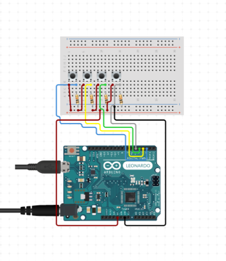

# Open Stream Deck

Open Source, do-it-yourself stream deck project for hackers and electronic enthusiasts.

## History

This is a fun project I've dedicated my freetimes to. I use it as an accessible way to manage my virtual OBS camera I use in microsoft teams video calls and my online presense.

## Requiremens

You're gonna need: 

1. Arduino leonardo (or any device having ATmega32u4)
2. Some push buttons
3. Some wires and a breadboard.

## Getting started with the project

The firmware is developed using PlatformIO tooling.

to upload the firmware to the board run:

```bash
pio run -t upload
```

to read serial logs use:
```bash
pio device monitor
```

After uploading the firmware, make sure your pull-up resistor push buttons work correctly.



## TODOs and vision for this project
In the future I will spend time implementing the following features:

- [] Cross platform OpenStreamDeck written using Fyne library in Golang (on going)
- [] Persisting user dynamic settings in EEPROM (on going)
- [] Adding OBS SDK integration to manage scenes and sources directly (TODO)
- [] Desing dedicated PCB using KiCAD (TODO)
- [] Design casing and buttons using blender (TODO)
